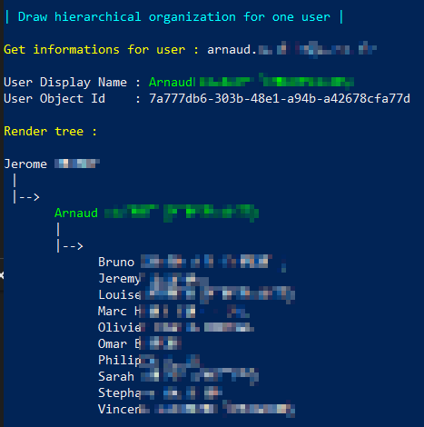
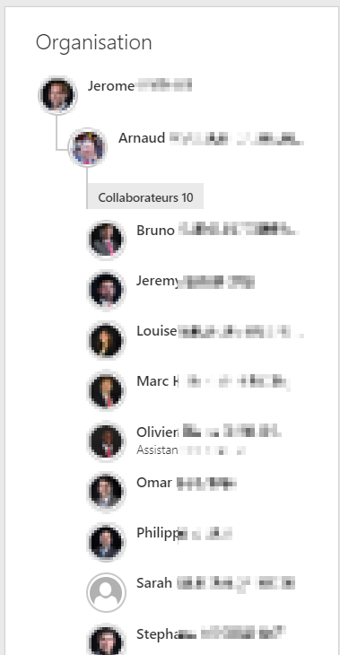

Show-HierarchicalOrganization
===================

Show-HierarchicalOrganization render a tree that represent a hierarchical organization for the user selected. Direct reports users and manager will be drawn. It looks like delve rendering.


## Usage :

Show-HierarchicalOrganization upn@domain.com


## Example :

Using the function with one user login
```
> Show-HierarchicalOrganization arnaud@contonso.com
```

## Powershell Rendering (EN) : 

 

## Delve Rendering (FR) : 

 
